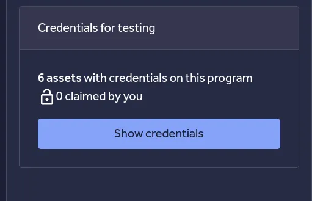

Good Day!

I hope you are doing well. Long time not writing anything… right? Well I am back again with two finding I have discoverd recently at some private program at Hackerone. I hope at the end you will going to learn something new :)

الحمدلله و الصلاة و السلام على سيدنا محمد

اللهم انصر اخواننا في فلسطين

In fact the bugs I am going to talk about not that much of complexity, the first bug is actually a simple IDOR with a High impact, but don't worry… I am not here to explain the IDOR. We are all know what the IDOR is and sick of it. I am here to tell you the secret -as I think- that leads me to find that High impact IDOR bug.

The bug is at the main domain www.target.com/users/settings/sso that allow users to setup their own SSO via Saml method. However, I have discovered that by just adding the parameter **account_id** to the url above I will be able to edit the SSO settings to other users!!

> *I am redacting alot of things in order not to disclose anything*

I asked my self, the bug is simple and exist at the main domain, why no one did find it? Well I think the answer is the **Show Credentials** Button in the Hackerone at the program page.



Sometimes programs provides the hacker with some credentials for testing. I don't think all the hackers will claimed that creds!! In my case , I took the creds , and I noticed that you can ask for a further privileges, all you have to do is providing your account username to the program. I sent my username to the program, and after 2 weeks I got that privileges. Here where the page www.target.com/users/settings/sso appeared to me!

### **Lesson Learned**

Don't hesitate taking the Credentials  and  don't you ever ignore any  form of asking the program for some account  privileges, fill it out and wait for it. Believe me, here come the gold mine of bugs.

The second bug came after reading the docs at help.traget.com and did a bit of fuzzing , then reported it and triaged as High impact.

I have read at the website documentation that I can show the users that belongs to me through this api : target.com/api/users/allusers

But it order to work, it needs to provide some parameters: *username*, *password* and *usersCount*

This is very interesting…because the endpoint has no Rate Limiting and here I thought of two attacks cases.

**Case 1**

Use [fuff](https://github.com/ffuf/ffuf) tool to fuzz the password of the user anasbetis for example.

```
ffuf -u http://target.com/api/users/allusers?username=anasbetis&password=FUZZ&userscount=10 -w passwords.txt
```

**Case 2**

Use [fuff](https://github.com/ffuf/ffuf) tool to get all the usernames that have the password 00000000 for example.

```
ffuf -u http://target.com/api/users/allusers?username=FUZZ&password=00000000&userscount=10 -w usernames.txt
```

and here comes the magic, after I run the above command , I got a lot of valid usernames that have the password 00000000

I was able to show their users and got sensitive information like emails and phones. But that is impossible that all of these users have the password 00000000!!!!

After some searching. It turns out that the server is failing to check the password parameter for some users :) and with that ffuf command I was able to reveal it.

A bit of searching in the docs, I discovered two other endpoints

```
target.com/api/users/updateusers
target.com/api/users/deleteusers
```

That means that I can Show/Edit/Delete Users. I reported it, and alhamdullilah it was triaged the next day as a High impact bug.


### Lesson Learned

Just by following the docs sometimes will show us very information that we could turn into high impact bugs. Don't you ever ignore the instruction or documentation provided by the website, it may reveal some gold mine endpoints that no one ever touch.

I hope you liked it. Yes there are simple bugs, but with a high impacts. Sometimes you just need to relax and do what the app says, and when you find the interesting point then try to break it.

Don't forget to follow me and leave a clap (You can do it up to 50 times!)

You can also enjoy my previous writeups.

Thanks for reading.

LinkedIn: [anas_hmaidy](https://www.linkedin.com/in/anas-hmaidy)

Twitter : [anasbetis023](https://x.com/anasbetis023)

Join my telegram channel: [anas_hmaidy](https://t.me/anas_hmaidy)

Buy me a coffee : [anas_hmaidy](http://www.buymeacoffee.com/anasbetis94)

**Cheers :)**
