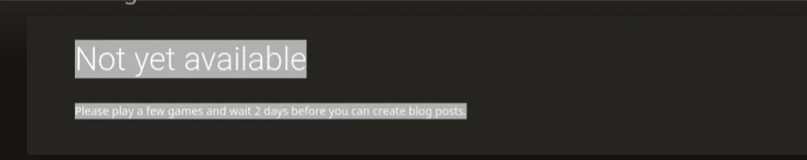
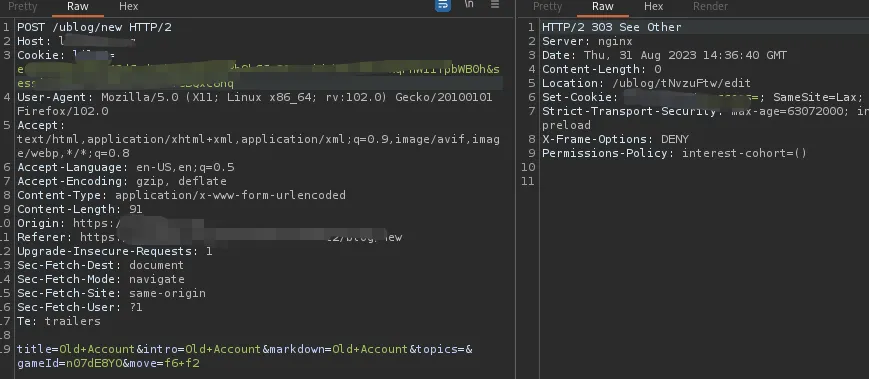
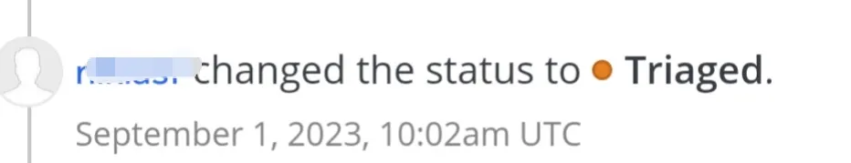

**Good Day!**

I hope you are doing well. Today, I am going to share a Broken Access Control (BAC) bug that I found a while ago in one of the HackerOne private programs. The website I was testing on is a popular chess platform, but I'll refer to it as redacted.com :)

**الحمدلله و الصلاة و السلام على سيدنا محمد**

Initially, I tested the platform using my main account instead of creating a new one. I spent two days testing, but I only received informative and "N/A" responses from the website security team.

I decided to create a new account to perform some A-B testing, but I still got no results. However, the website has a function for creating and posting blogs.I played around with this feature and created a new test blog, but when I clicked "post" I received a message saying:

"**Please play a few games and wait 2 days before you can create blog posts**" as you can see.



The website seemed to have some restrictions on new accounts, but it's OK challenge accepted. Since I was able to post blogs from my main account, I created a new blog and clicked "post" Then, I intercepted the request with Burp Suite and sent it to the repeater. I replaced the cookies in the request with the cookies from my new account and clicked "send"




The website redirected me to the new blog's ID

```
Location: /ublog/tNvzuFtw/edit
```

I copied the path, pasted it into the browser on my new account's session, and Congrats! The blog was created under the name of the new account :)

I reported the bug as "**Unauthorized Blogs Creation**", and Alhamdulilah, the program triaged it.



While the bug itself wasn't a high-impact one and the key thing is just cookies manipulation. I learned a valuable lesson, it's important to read a website's policies and understand their rules to identify potential bugs. Getting into the website logic and functions is the key of finding some assets that will helps you finding bugs.

Learn more about access control : <https://portswigger.net/web-security/access-control>

I hope you enjoyed this write-up! Please feel free to follow me and leave claps (you can do it up to 50 times!).

Read my previous write-ups

[How One Bug Scored me Double Rewards](https://anasbetis023.medium.com/how-one-bug-scored-me-double-rewards-355b8d02cdbf)

[Bugs&JS: A Cloesr Look at JavaScript for Successful Bug Hunting](https://anasbetis023.medium.com/bugs-js-a-closer-look-at-javascript-for-successful-bug-hunting-fddb0d796498)

Join my telegram channel: [anas_hmaidy](https://t.me/anas_hmaidy)

Follow me on LinkedIn: [anas_hmaidy](https://www.linkedin.com/in/anas-hmaidy)

Buy me a coffee : [www.buymeacoffee.com/anasbetis94](https://www.buymeacoffee.com/anasbetis94)

**Best Regards :)**
