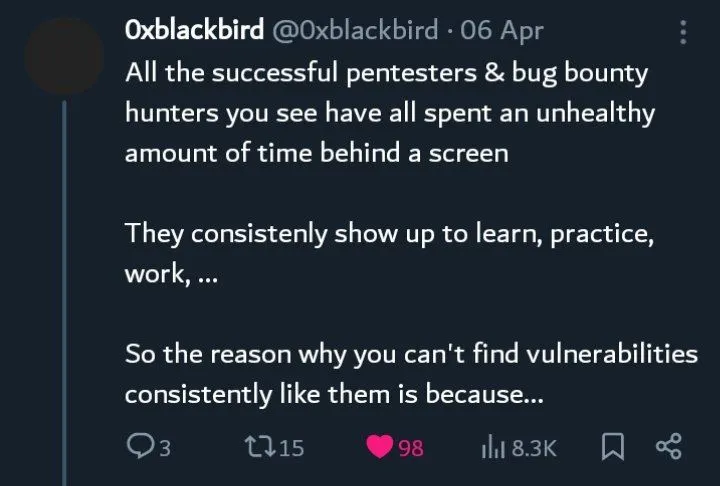
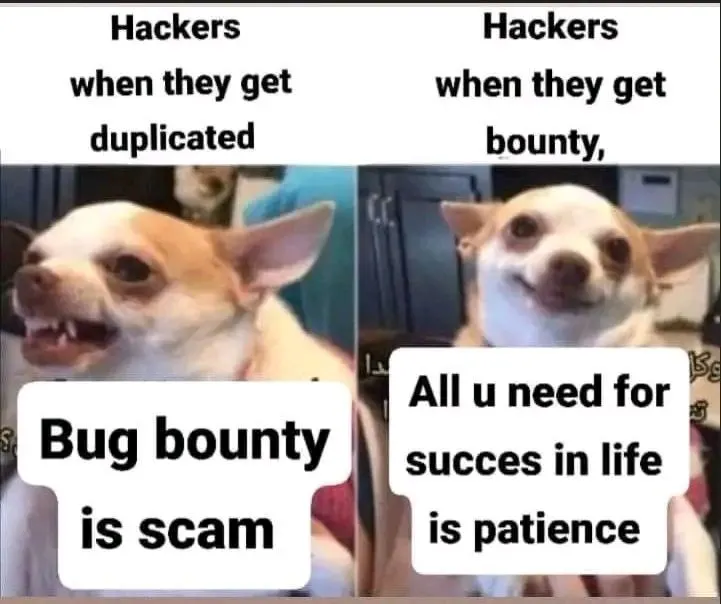

**Good morning!**

I hope you're doing well. Thank you for joining me today. Probably you're here because of the attractive title.I mean who doesn't want to make easy money in just a couple of hours every day? Especially if you live in the Middle East, India, or Africa. A reward with three or four digits can really make a difference.

However, I'm here to tell you that I didn't earn any easy money sadly. I wanted to talk about something I've been thinking about a lot in the past few weeks.

I see a lot of write-ups about some bug hunters posting stuff like "How easy I earned 1000$" or "RCE in 30 min" and a lot of these titles. Eight months ago, when I was just starting out, these kinds of blogs were really discouraging. I thought, "Here I am, hunting every day for nothing, and other people are just getting money left and right?"

Unfortunately. These types of posts are very bad to new bug hunters. They make readers feel like it's an easy thing, and then when they try bug hunting themselves, they only find duplicate bugs and get discouraged, thinking they're failures.

Recently, I decided to stop reading and following these kinds of articles for several reasons. First, I don't always know if the writer is truly honest. I'll only read them if the hunter is well-known within the bug hunting community. Second, am I really going to learn anything new from these articles? Most likely not. I'm probably just going to read a made up story from someone I don't know.

I recently found a path traversal vulnerability with just 30 minutes of GitHub dorking on a specific domain. I could have easily posted it with a title like "An Easy High Bug in 30 Minutes," right? But here's what I wouldn't tell you: it took me six days of reconnaissance and subdomain gathering to land on the specific scope where I decided to dork. Now the story makes sense.

A great story by [Shreyas Chavhan](http://shreyaschavhan.notion.site/) details how he made $15,000 in his first eight months of bug hunting. He shared that he spent a total of 636 hours to achieve those results. However, in the first 582 hours of his work, he only made $1,300 out of the $15,000. But at the end by persistence he did what he wanted. Success in bug hunting follows an exponential distribution, but people want it to be linear.

Another point I want to address is staying updated on the latest news and trends. I decided to follow bug bounty hunters on Twitter, but all I saw were people posting useless things like, "I got a reward from HackerOne!" or "I reported a bug in under 15 minutes!" I remember once checking the #bugbountytips hashtag on Twitter. The tips were like "Spend more time on your target" or "Read all the JS files." Seriously? I wish there was a filter button to hide these kinds of posts.

The best platform I've found is actually Reddit and some Telegram channels. There are some communities that only share valuable content like [websecurityresearch](https://www.reddit.com/r/websecurityresearch/) and [netsec](https://www.reddit.com/r/netsec/) . LinkedIn is also a good option, but you have to be selective about the posts you follow. Finally, [CTBBP](https://www.criticalthinkingpodcast.io) is a great resource. The guys have discussions about new things every week.

At the end, I am not the best to give advice. Follow people like Jhadix, [hakluke](https://github.com/hakluke/hakrawler),z[seano](https://www.bugbountyhunter.com/methodology/),Nhamsec, Ebrahem Hegazy ,Frans Rosen,Orange,albinowax and more…

I hope this post provides a more realistic picture of what to expect when starting out as a bug hunter. It's hard work, and continuous learning. I hope you like it. Don't forget to follow me and leave a clap (You can do it up to 50 times!) Thanks for reading.

LinkedIn: [anas_hmaidy](https://www.linkedin.com/in/anas-hmaidy)

Twitter : [anasbetis023](https://x.com/anasbetis023)

Join my telegram channel: [anas_hmaidy](https://t.me/anas_hmaidy)

Buy me a coffee : [anas_hmaidy](http://www.buymeacoffee.com/anasbetis94)

**Bay :)**
