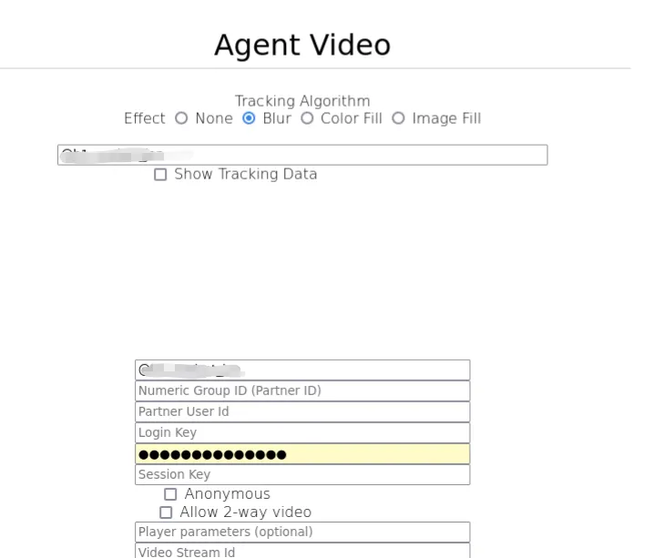
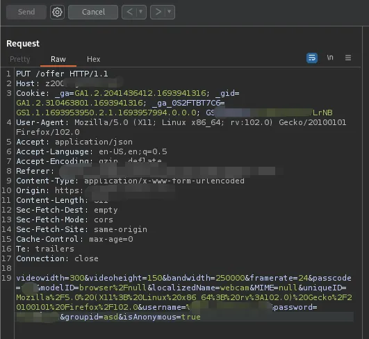
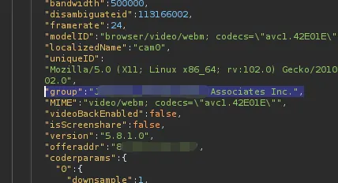
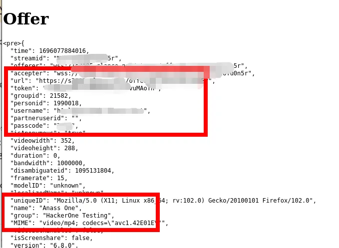

Good day! I hope you are well.

I'll get straight into a couple of bugs I found a while ago in a private program on HackerOne. Let's call it **redacted.com** :)

The program resolves any subdomain (`anything.redacted.com`) to the main login page (`redacted.com/login`). That behavior was new to me, so I initially thought subdomain-gathering tools would be useless here.

I started with a simple [Shodan](https://www.shodan.io/) dork:

```
ssl:redacted.com
```

Plenty of results came up, until I found an IP resolving to the subdomain `z2007.redacted.com` — **interesting!** From the name, `z2007` looked like some old, forgotten server.

The main product does video sessions and screen-sharing. After some digging, I found a test page at `z2007.redacted.com/agv/sampleAgent.html`.



<!-- screenshot: the test page (add image here if you want) -->

Let's send a request and intercept it. The `PUT /offer` request body was interesting. I changed everything to see how the response reacted, and it stayed the same — except when I changed the `groupid` parameter: you supply a `groupid`, and the server responds with the **group name**.



At first this didn't seem interesting, but thinking about the product's features, that group name was something not exposed anywhere else. So I reported it as **"Information Disclosure [Group Name Manipulation]"** — the program agreed the group name shouldn't be disclosed without authentication, and I got a **$100** bounty :)

Should we stop here? I don't think so. If one subdomain has the bug, another might too — so visit every possible subdomain and send the same `PUT` request.

With some Google dorking I gathered more subdomains and replayed the `PUT /offer` request against each. At first, nothing — and I almost stopped. But the bug is there; you just have to search harder. Luckily, `video.redacted.com` accepted the `PUT` requests. Digging in, the server accepted three parameters: `groupid`, `isAnonymous`, and a new one — `personid`.

```
https://video.redacted.com/offer?groupid=21582&isAnonymous=true&personid=1990018
```

Intercept the request, change the method to `PUT`, forward it — and **wow**, a lot of data came back.



I could register a video session for anyone in any group; modifying `groupid` and `personid` returned new session data each time.

I reported it as **"IDOR Leads to Unauthorized Access to Sensitive User Session Data"**, the program accepted it, and rewarded me with **$200**.

In the end, things didn't go smoothly with HackerOne support: they withheld the rewards because I live in Syria and, due to U.S. sanctions law


I wasn't eligible to receive them. But it doesn't matter — money will come sooner or later. As they say, you're only responsible for the effort, not the outcome.

Hope you enjoyed it!
