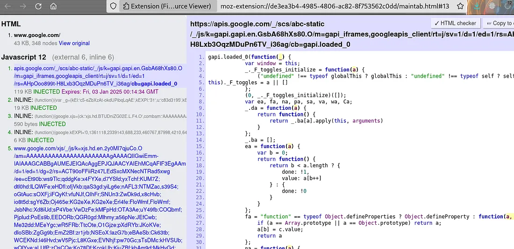

**Good Day!**

Remember when I first started bug hunting? I used to think looking into JS files was unnecessary — would I really find bugs in files everyone can see? But after some reading, I realized I was missing out on a lot. So I want to share some resources, tools, tutorials, and other ways to dig deeper into JavaScript analysis.

## Resources and Tools

Diving into JS files can be very rewarding. It lets you uncover hidden functionality, credentials, API keys, paths, and more — especially valuable for finding client-side vulnerabilities like XSS.

A great starting point is this short video where Tomnomnom talks about Chrome Dev Tools and shares some cool tips: [watch here](https://youtu.be/FTeE3OrTNoA?si=BBStD_1KU_gFqwWP).

My own approach is simple: I read JS files manually to see if anything catches my eye. For quick viewing of HTML, JavaScript, and CSS I use the [Fire Source Viewer](https://addons.mozilla.org/en-US/firefox/addon/fire-source-viewer/) extension. Leave a comment if you know a better one.


For automated help I usually reach for two tools:

1. [**JSleak**](https://github.com/byt3hx/jsleak) — an easy-to-use command-line tool for uncovering secrets and links in JavaScript files.
2. [**JSecret**](https://github.com/raoufmaklouf/jsecret) — a simple, fast tool for detecting sensitive data in source code such as JavaScript files.

```bash
echo "http://target.com" > target.txt
cat target.txt | grep ".js$" | uniq | jsleak -l -s
cat target.txt | grep ".js$" | uniq | jsecret
```

Notes:

- `grep ".js$"` matches lines ending in `.js` (without the `$` it would also grab `.json` files).
- `uniq` removes repeated lines.

Another approach I picked up from [Jayesh](https://ae.linkedin.com/in/jayesh-madnani) (one of the top 15 on HackerOne) is to collect URLs with Katana and waymore, filter the `.js` files, download them with wget or curl, and run [jsluice](https://github.com/BishopFox/jsluice) on them.

More important than any tool, though, is learning the **JS fundamentals**: the Document Object Model (DOM), how JavaScript handles events (clicks, keypresses, form submissions) and how to attach handlers, Ajax and the Fetch API, and more. I don't know one course that covers it all, but you can search and learn each concept as you go.

I also highly recommend this [Arabic playlist](https://www.youtube.com/watch?v=nLMs1aXdkgk&list=PLcCG2wDOBXAWGn-_ZAWUfvwu_RkBtNxPt) on doing JS analysis with different methods.

A few JS-related bug reports worth studying:

- Admin account/panel takeover via DOM-based XSS — [report](https://hackerone.com/reports/1619445)
- API leak in a JS file — [report](https://hackerone.com/reports/1218754)
- JavaScript injection and JS bridge takeover — [report](https://hackerone.com/reports/1343300)

I'm no JS master — I just wanted to share some helpful experience. Don't forget to check out my previous [write-up](/posts/how-one-bug-scored-me-double-rewards/). Hope you found this interesting!
